# 一、DQN解决MountainCar

## 1.前置知识点

### 1.1 MountainCar

MountainCar问题中，小车每次都被初始化在一个山谷的谷底，其目标是以最少的移动次数到达右侧山顶黄色小旗的位置。小车无法直接开到山顶位置，因为其发动机的动力不足。唯一能够成功的方式就是让小车通过左右移动来积蓄足够的动量以冲向山顶。

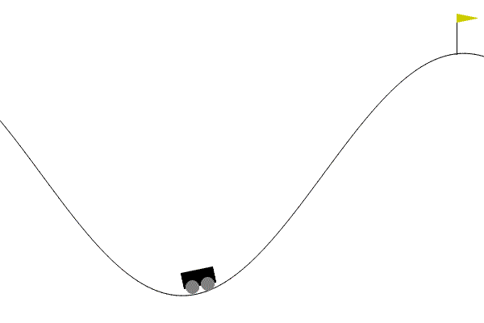

MountainCar问题中，智能体就是小车，环境是小车所属的运动空间，小车与环境进行交互后会获得当前的状态，状态包括以下两个状态变量

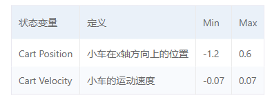

小车会根据当前的状态，依据现有的策略执行相应的动作

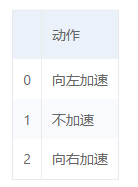

MountainCar中，触发以下两种情况中的任何一种则表示一轮实验终止（注意一轮实验就是一个episode）：

1. 小车达到右侧小旗的位置
2. 小车的移动次数超过200次

小车每次都会根据当前状态执行上述三种动作之一，若没有触发终止条件则小车每移动一次都会获得reward=-1。

### 1.2 DQN算法

DQN算法中，智能体与环境进行交互后，会获得环境提供的状态s~t~。接收到该观测值后，智能体会根据神经网络对当前状态下的不同action的Q值进行预测，同时返回一个选择的行动α~t~。智能体将该行动反馈给环境，环境会给出对应的奖励r~t~、新的状态s~t+1~以及一个bool值，代表是否触发终止条件。每次智能体和环境的交互完成后，DQN算法会将（即s~t~,α~t~,r~t~,s~t+1~）作为一条经验存储在经验池中，然后随机抽取一批经验作为输入对神经网络进行训练。

一般的，构建智能体的框架结构如下（智能体与环境交互图）

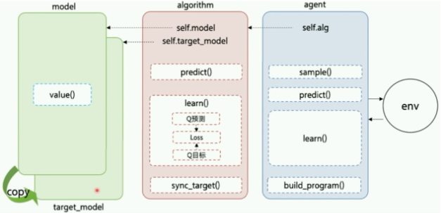

- Model：用来定义前向 (Forward) 网络，通常是一个策略网络 (Policy Network) 或者一个值函数网络 (Value Function)，输入是当前环境状态。在MountainCar的实验中，将在Model结构中构建一个值函数网络，用于获得在当前环境状态下所有action对应的Q值。

- Algorithm：定义了具体的算法来更新前向网络 (Model)，也就是通过定义损失函数来更新 Model，与算法相关的计算都可定义在Algorithm中。

- Agent：Agent负责算法与环境的交互，在交互过程中把生成的数据提供给Algorithm来更新模型。

DQN算法采用经验回放和目标网络冻结作为创新点：

- 经验回放(Experience Replay)：使用一个经验池存储多条经验s,a,r,s', 再从中随机抽取一批用于训练，很好的解决了样本关联性的问题，同时，因为经验池里的经验可以得到重复利用，也提升了利用效率。
- 目标网络冻结(Freezing Target Networks)：复制一个和原来Q网络结构一样的Target Q网络，在一个时间段内固定Target Q网络的参数，用于计算Q目标值，这样在原来的Q网络中，target Q就是一个固定的数值，不会再产生优化目标不明确的问题。

DQN算法的主要流程如下

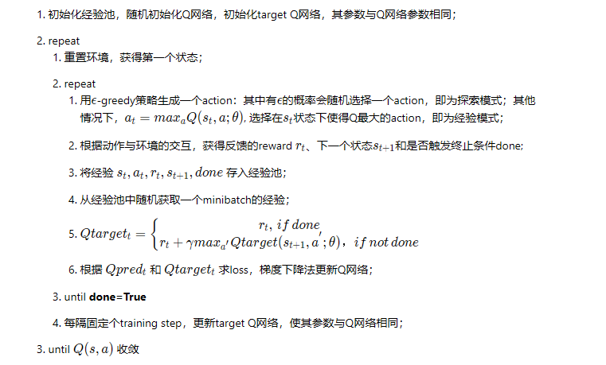

## 2.实验设计

使用DQN算法解决MountainCar问题的主要步骤如下：

1. 构建模型：主要包含设计Agent、定义经验回放算法、DQN模型等；
2. 训练配置：定义超参数，加载实验环境并实例化模型；
3. 训练模型：执行多轮训练，不断调整参数，以达到较好的效果；
4. 模型评估：使用训练好的模型进行MountainCar测试，可对其进行可视化观察Agent的表现，同时计算平均reward；

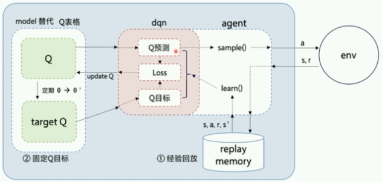

### 2.1 模型构建

#### 2.1.1 经验回放

为了解决样本的相关性过强并提高数据的使用率，DQN采取经验回放的方法。经验回放算法的核心思想是通过存储和重复使用先前的经验来打破时间上的相关性，提高训练的效率和稳定性。它还可以更好地利用样本数据，减少在环境中采集样本的次数

经验回放算法的基本执行步骤如下：

1. 经验存储：使用一个固定大小的经验存储器（experience replay buffer）来存储智能体在环境中的经验。这些经验包括当前状态、采取的动作、获得的奖励、下一个状态以及一个标记，表示该经验是否是终止状态。
2. 经验收集：智能体与环境进行交互，根据当前的策略选择动作，并观察环境的反馈。智能体将这些经验（也称为样本）添加到经验存储器中。
3. 经验回放：从经验存储器中随机采样一批经验样本。这是与传统的在线学习不同之处，传统方法通常是即时使用新采集的样本进行学习。通过从经验存储器中随机采样，可以打破样本间的相关性，减少梯度下降的方差。
4. Q网络更新：使用采样得到的经验样本进行Q网络的更新。对于每个样本，计算目标Q值和当前Q值之间的差异，然后使用梯度下降方法最小化这个差异来更新Q网络的参数。
5. 重复训练步骤：重复执行经验收集、经验回放和Q网络更新的步骤，直到达到预设的训练步数或满足停止条件。

下面的代码实现了一个经验回放类，也可以称为经验池类。主要包含以下属性：

- `memory`经验池，用于存储经验对象。

- `capacity`表示经验池的容量，即可以存储的经验数量的最大值。

- `Transition`是一个转换函数或类，用于将输入的参数组合成经验对象。

经验池类除了包含基本的初始化方法外，还包含以下方法：

1. `push(self, *args)`: 该方法接受任意数量的参数，并将这些参数作为输入创建一个新的经验对象，并将其添加到经验池中。
2. `sample(self, batch_size)`: 经验采样方法，它从经验池中随机选择指定数量的经验对象进行采样。
3. `__len__(self)`: 返回当前经验池中的经验数量，即`self.memory`的长度。

经验池类的完整代码如下

```py
class ReplayMemory(object): # 经验回放算法
    def __init__(self, capacity,transition):
        self.capacity = capacity # 经验池容量
        self.memory = deque(maxlen=capacity)  # 使用deque数据结构作为经验池，设置最大长度为容量
        self.Transition = transition

    def push(self, *args):
        self.memory.append(self.Transition(*args))  # 直接使用append方法添加经验

    def sample(self, batch_size):
        batch = random.sample(self.memory, batch_size) # 从经验池中随机采样
        return batch

    def __len__(self):
        return len(self.memory) # 返回经验池中的经验数量
```

#### 2.1.2 DQN模型

DQN模型通过估计网络和目标网络的交替更新来实现Q值的逼近和训练，通过最小化估计值和目标值之间的损失来提高模型的性能。实现DQN模型主要需要实现DQN模型的核心功能，DQN模型通过估计网络和目标网络的交替更新来实现Q值的逼近和训练，通过最小化估计值和目标值之间的损失来提高模型的性能等。

DQN模型的主要属性如下：

- `layers`是一个列表，表示神经网络的层结构。
- `lr`是超参数学习率，默认为0.0005。
- `optim_method`是优化器的选择，默认为Adam优化器。

在DQN类的初始化方法中，调用`build_model()方法`创建了目标网络（`TargetNetwork`）和估计网络（`EstimateNetwork`），并初始化了损失函数（`MSELoss`）和优化器（`optimizer`）

```py
def build_model(self): # 构建模型
        def init_weights(layer):
            if isinstance(layer, nn.Linear):  # 使用isinstance检查类型
                nn.init.xavier_normal_(layer.weight)

        self.EstimateNetwork = nn.Sequential(*self.layers) # 使用nn.Sequential构建神经网络
        self.EstimateNetwork.apply(init_weights) # 使用apply方法初始化权重

        self.TargetNetwork = copy.deepcopy(self.EstimateNetwork)  # 使用copy.deepcopy进行深拷贝
        self.TargetNetwork.load_state_dict(self.EstimateNetwork.state_dict()) # 使用load_state_dict加载参数

        self.optimizer = self.optim_method(self.EstimateNetwork.parameters(), lr=self.lr) # 使用优化器优化估计网络
```

build_model方法顾名思义，就是用于构建网络模型，其中的辅助方法init_weights用于初始化权重。该方法首先使用nn.Sequential构建EstimateNetwork神经网络，然后初始化其权重。接下来通过深拷贝将EstimateNetwork的参数拷贝给TargetNetwork，最后调用优化器对EstimateNetwork进行优化。

除了初始化方法和build_model方法外，DQN类还有以下类方法：

- `Q_target(self, inp)`: 该方法用于计算目标值，接受输入`inp`并返回目标网络对输入的输出。
- `Q_estimate(self, inp)`: 该方法用于计算估计值。
- `update_target(self)`: 该方法用于更新目标网络，将估计网络的参数复制给目标网络，以便更新目标值时使用。
- `update_parameters(self, estimated, targets)`用于更新网络参数。该方法计算估计值和目标值之间的损失，在更新网络参数之前还会进行梯度清零和反向传播以及梯度裁剪操作，最后调用优化器的step方法来更新参数。

#### 2.1.3 Agent类

DQN算法中的智能体类负责定义智能体的行为策略、管理经验回放池和执行模型的优化，从而使得智能体能够通过与环境的交互逐渐学习并改进其决策能力。DQN算法中的Agent需要具备如下基本功能：

1. 定义动作选择策略：Agent类中的`act`方法根据当前状态选择动作。它根据ε-greedy策略，在一定的探索率ε下，以一定概率随机选择动作，以便探索环境；否则，根据当前策略（由DQN模型给出）选择具有最大动作值的动作。这种策略使得智能体能够在探索和利用之间进行权衡。
2. 经验回放池管理：Agent类中的`memory`对象是一个经验回放池（Replay Memory），用于存储智能体与环境之间的交互经验。它可以存储过去的状态、动作、奖励、下一个状态等，并且支持从中随机采样一批经验用于模型的优化。经验回放池的作用是使得智能体可以从先前的经验中进行学习，打破时间上的相关性，提高样本的有效利用率。
3. 模型优化：Agent类中的`optimize`方法实现了DQN算法中的优化步骤。它从经验回放池中采样一批经验数据，计算当前状态的动作值估计和下一个状态的目标值，并使用这些值来更新DQN模型的参数。通过不断迭代优化模型参数，智能体可以逐渐提高其在环境中的表现和决策能力。

下面的代码实现了一个名为Agent的智能体类，该类主要有如下属性：

- `device`：模型计算使用的设备。
- `transition`：用于定义经验回放池中的转换数据结构。
- `env`：交互环境，即智能体进行训练和决策的环境。
- `model`：DQN模型，用于估计和优化动作值函数。
- `n_actions`：动作空间的大小。
- `goal`：目标分数，当智能体达到或超过该分数时，任务被认为是成功的。
- `min_score`：最低分数，当智能体的得分低于该分数时，任务被认为是失败的。
- `eps_start`：初始的ε-greedy策略中的ε值，用于探索动作空间。
- `eps_end`：最终的ε-greedy策略中的ε值，探索策略随时间衰减。
- `eps_decay`：ε-greedy策略中ε的衰减率。
- `gamma`：折扣因子，用于计算目标值的折扣累积奖励。
- `batch_size`：每次优化时从经验回放池中抽样的批次大小。
- `memory_size`：经验回放池的最大容量。
- `max_episode`：最大训练轮数。
- `upd_rate`：目标网络更新频率，表示每经过多少次优化操作后更新目标网络。

Agent类的`act`方法实现了根据给定状态和探索率选择一个动作的功能，根据随机数与ε值的大小比较对动作进行选择

```py
def act(self, state, eps):
        if random.random() < eps: # 若随机数小于epsilon，随机选择动作
            return torch.tensor([[random.randrange(self.n_actions)]], device=self.device, dtype=torch.long) # 随机选择动作
        else: # 否则使用当前策略
            with torch.no_grad():
                result = self.model.Q_estimate(state).max(1)[1] # 选择最大的动作
                return result.view(1, 1)
```

`optimize`方法用于执行DQN算法中的优化。基本的执行步骤如下：

1. 判断经验池中的经验数量大小与批大小的关系：
   - 如果经验回放池中的经验数量小于批大小，则不执行优化，直接return结束optimize方法
   - 否则执行优化
2. 从经验回放池中采样一个批次的经验数据，并进行转换；
3. 计算当前状态的估计值和下一个状态的目标值
   - 估计值由当前状态和选择的动作对应的Q值估计给出
   - 目标值由下一个状态的最大Q值和实际奖励计算得到
4. 使用目标值来更新模型的参数

以下是optimize方法的代码实现

```py
def optimize(self): # 优化模型
        if len(self.memory) < self.batch_size: # 若经验池中的经验数量小于批大小，不进行优化
            return

        transitions = self.memory.sample(self.batch_size) # 从经验池中采样
        batch = self.Transition(*zip(*transitions)) # 将经验转换为批

        next_state_batch = torch.cat(batch.next_state) # 将批中的下一个状态拼接为一个张量
        state_batch = torch.cat(batch.state) # 将批中的状态拼接为一个张量
        action_batch = torch.cat(batch.action)
        reward_batch = torch.cat(batch.reward)
        done_batch = torch.cat(batch.done)

        estimate_value = self.model.Q_estimate(state_batch).gather(1, action_batch) # 估计值

        Q_value_next = torch.zeros(self.batch_size, device=self.device) # 目标值
        with torch.no_grad():
            Q_value_next[~done_batch] = self.model.Q_target(next_state_batch).max(1)[0].detach()[~done_batch] # 若未结束，使用目标网络计算目标值
        target_value = (Q_value_next * self.gamma) + reward_batch # 计算目标值

        self.model.update_parameters(estimate_value, target_value) # 更新参数
```

### 2.2 训练配置

训练配置的具体流程为：

1. 设置超参数、创建模型
2. 创建模型
3. 实例化Agent代理

本实验需要借助gym库创建MountainCar环境，其常用的API如下所示

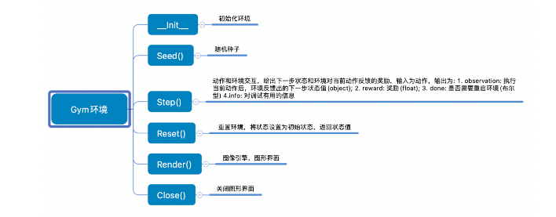

通过gym创建MountainCar训练环境并设置全局变量

```py
device = torch.device("cuda" if torch.cuda.is_available() else "cpu")  # 选择设备
env = gym.make('MountainCar-v0')  # 创建环境
n_actions = env.action_space.n  # 动作空间
n_states = env.observation_space.shape[0]  # 状态空间
Transition = namedtuple('Transition',
                            ('state', 'action', 'next_state', 'reward', 'done'))  # 定义一个命名元组，用于存储经验（状态，动作，下一个状态，奖励，是否结束）
```

然后通过自定义的layers传入DQN类实例化模型

```py
# 神经网络
layers = (
        nn.Linear(n_states, 256),  # 输入层
        nn.ReLU(),  # 激活函数
        nn.Linear(256, 256),  # 隐藏层
        nn.ReLU(),  # 激活函数
        nn.Linear(256, n_actions),  # 输出层
    )
Model = DQN(layers, lr=0.0005, optim_method=optim.Adam)  # 创建模型
```

最后对智能体进行实例化

```py
MountainCarAgent = Agent(device, Transition, env, Model, n_actions, goal=-110, min_score=-200, \
                             eps_start=1, eps_end=0.001, eps_decay=0.9, gamma=0.99, \
                             batch_size=64, memory_size=100000, max_episode=2000)
```

### 2.3 训练模型

在训练模型的过程中，主要有以下几个关键点：

- 经验回放：通过将每个经验存储在经验回放池中，并从中随机采样进行训练，可以增加样本的独立性和稳定性，有助于提高算法的收敛性。
- Q值目标计算：在计算目标值时，对原始奖励进行修改。通过使用差异化的奖励计算方式，可以加速学习过程。同时在计算目标值时引入了状态变化的差异，这可以帮助Agent更好地理解任务的状态变化。
- Target网络更新：在代码中实现对目标网络的更新。通过定期将估计网络的参数复制给目标网络，可以减少目标值的不稳定性，从而提高算法的稳定性和收敛速度。
- ε-greedy策略：使用ε-greedy策略进行动作选择。该策略以ε的概率选择随机动作，以1-ε的概率选择基于估计值的动作。这样可以在一定程度上保证探索与利用的平衡，有助于Agent在探索和最优动作之间进行权衡。

基于DQN算法的在MountainCar环境下进行模型训练的具体步骤如下：

1. 初始化训练参数和数据记录：
   - 初始化智能体的参数、设备、目标分数和最低分数等。
   - 创建空列表，用于记录每个episode的奖励。
   - 初始化连续成功的次数。
2. 开始训练循环：
   - 使用for循环迭代训练的episode次数。
   - 重置环境状态，获取初始状态。
   - 将初始状态转换为张量，并放入设备中。
3. 执行每个episode的动作选择、环境交互和优化过程：
   - 使用while循环，直到达到episode结束条件（结束标志done为True）。
   - 根据当前状态和探索率选择一个动作。
   - 将动作转换为张量，并放入设备中。
   - 执行动作，获取下一个状态、奖励、结束标志done和其他信息。
   - 计算该步骤的奖励。
   - 根据特定公式修改奖励。
   - 将next_state、action、modified_reward和done转换为张量，并放入设备中。
   - 将状态、动作、下一个状态、奖励和结束标志存储到经验回放池中。
   - 更新当前状态为下一个状态。
   - 调用agent.optimize()方法进行模型的优化。
4. 更新目标网络和探索率：
   - 如果当前episode是目标网络更新的步骤（每经过agent.target_update_rate个episode），则更新目标网络的参数。
   - 更新探索率，将其乘以衰减率但不会小于最终探索率。
5. 记录奖励并检查训练是否成功：
   - 将当前episode的奖励添加到all_scores列表中。
   - 每50个episode，计算最近50个episode的平均奖励，并输出平均奖励。
   - 如果连续5个episode的平均奖励大于等于目标分数，则认为训练成功。
     - 如果训练成功，则输出训练成功的episode数，并可以进行模型保存等操作。
     - 否则，重置连续成功的次数为0。
6. 返回记录的奖励列表all_scores。

具体的代码以及注释参考代码文件。

### 2.4 模型评估

训练完成后，对模型进行评估，评估模型主要是在一个while循环中，测试指定episodes轮：

1. 选择并执行动作，获取下一个状态、奖励和完成标志；
2. 累积当前episode的奖励；
3. 判断是否达到episode结束条件，若游戏结束则更新计数器和记录奖励，然后重置reward以及状态；
4. 输出评估结果；

如下是模型评估的代码

```py
def test(agent, episodes=50, render=False):
    print('----------Start testing----------')
    state = agent.env.reset() # 初始化状态
    state = torch.tensor(state).to(agent.device).float().unsqueeze(0)
    ep_count = 0
    current_episode_reward = 0
    scores = []
    while ep_count < episodes: # 默认测试50个episode（如果不开渲染可以测试100个或更多）
        if render:
            agent.env.render()
        action = agent.act(state, 0) # 选择动作
        state, reward, done, _ = agent.env.step(action.item()) # 执行动作
        state = torch.tensor(state).to(agent.device).float().unsqueeze(0) # 转换为tensor
        current_episode_reward += reward # 计算reward

        if done: # 如果游戏结束
            ep_count += 1 # episode数加1
            scores.append(current_episode_reward) # 记录每个episode的reward
            current_episode_reward = 0 # 重置reward
            state = agent.env.reset() # 重置状态
            state = torch.tensor(state).to(agent.device).float().unsqueeze(0) # 转换为tensor

    print('average score:', sum(scores) / len(scores))
    print('max reward:', max(scores))
    print('min reward:', min(scores))
```

## 3.实验结果分析

模型训练完毕后，可以看到模型训练过程的输出以及对应的可视化图像

```
----------Start training----------
episode 50 : -190.2 average score
episode 100 : -135.48 average score
episode 150 : -134.14 average score
episode 200 : -134.42 average score
episode 250 : -119.28 average score
episode 300 : -123.76 average score
episode 350 : -121.5 average score
success at episode 377
```

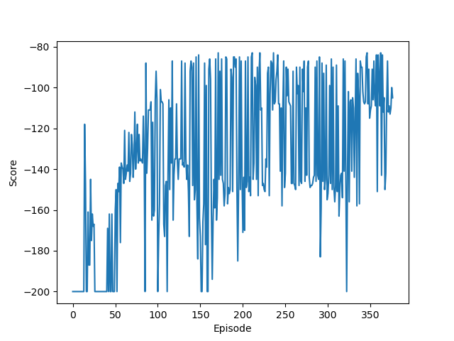

模型训练的最大轮数为2000个episode，目标分数是-110，最低分数是-200。可以看到模型在第377个episode训练完成，这表示连续5个episode的平均奖励大于等于目标分数。

观察训练图像可以看出，随着episode的增加，模型的分数也越来越高，最后可以稳定在-100到-120之间。

这里需要注意选择合适的学习率非常重要，一开始我选择使用的学习率是0.0001，但是因为其过小导致模型一直无法收敛，训练200轮后得分仍然在-190左右。

利用训练好的模型在MountainCar环境下进行测试，其输出如下

```
----------Start testing----------
average score: -116.9
max reward: -86.0
min reward: -157.0
```

如果在test函数中设置render为True，还可以看到每次小车的运动轨迹。这里我们对小车进行了50次测试，其平均分数为-116.9，可以看到这个分数与目标分数接近，这也表示模型训练的结果较好。

小车通过DQN算法不断学习和改进，以实现用最少的移动次数快速到达终点。


# 二、DDPG解决MountainCarContinuous

## 1.前置知识点

MountainCarContinuous与MountainCar的区别在于，其动作也就是应用的引擎力应当是连续值。此处不再赘述，这部分主要重点介绍DDPG算法。

DDPG(Deep Deterministic Policy Gradient)算法是一种专门用于解决连续控制问题的在线式深度强化学习算法，借鉴了DQN算法中的一些思想。

在求解连续动作空间问题时主要有两种方式，一种是对连续动作做离散化处理后利用强化学习算法如DQN进行求解；另一种是使用Policy Grandient算法如Reinforce直接求解。对于第一种方式，离散化的处理会导致结果不符合实际情况；而对于第二种方式来说，PG算法在求解连续控制问题时效果又不是很好。

DDPG算法是AC框架下的一种在线深度强化学习算法，算法内部包括Actor网络和Critic网络，每个网络分别遵从各自的更新法则进行更新从而使得累计期望回报最大化。

DDPG算法将确定性策略梯度算法和DQN算法中的相关技术结合在一起，具体而言，DDPG算法主要包括以下三个关键技术：

- 经验回放：智能体将得到的经验数据放入经验池中，更新网络参数时按照批量进行采样；
- 目标网络：在Actor网络和Critic网络外再使用一套用于估计目标的Target Actor网络和Target Critic网络。在更新目标网络时，为了避免参数更新过快，采用软更新方式；
- 噪声探索：确定性策略输出的动作为确定性动作，缺乏对环境的探索。在训练阶段，给Actor网络输出的动作加入噪声，从而让智能体具备一定的探索能力；

(1)经验回放

经验回放是一种让经验概率分布变得稳定的技术，可以提高训练的稳定性。经验回放主要有“存储”和“回放”两大关键步骤：

- 存储：将经验以固定形式存储到经验池中；
- 回放：按照某种规则从经验池中采样一条或多条数据；

经验回放的优点：

- 在训练Q网络时，可以打破数据之间的相关性，使得数据满足独立同分布，从而减小参数更新的方差，提高收敛速度。

- 能够重复使用经验，数据利用率高，对于数据获取困难的情况尤其有用。

经验回放的缺点：

- 无法应用于回合更新和多步学习算法。但是将经验回放应用于Q学习，就规避了这个缺点。

(2)目标网络

因为DDPG是基于AC框架的算法，因此必然会包含Actor和Critic网络。额外的，每个网络都有其对应的目标网络，因此DDPG算法一共包含四个网络分别是Actor,Critic,Target Actor和Target Critic。

算法更新主要更新的是Actor和Critic网络的参数，其中Actor网络通过最大化累积期望回报来更新，Critic网络通过最小化评估值与目标值之间的误差来更新。在训练阶段，从Replay Buffer中采样一个批次的数据。假设采样得到的一条数据为(s,α,r,s',done)，则Actor和Critic网络的更新过程如下

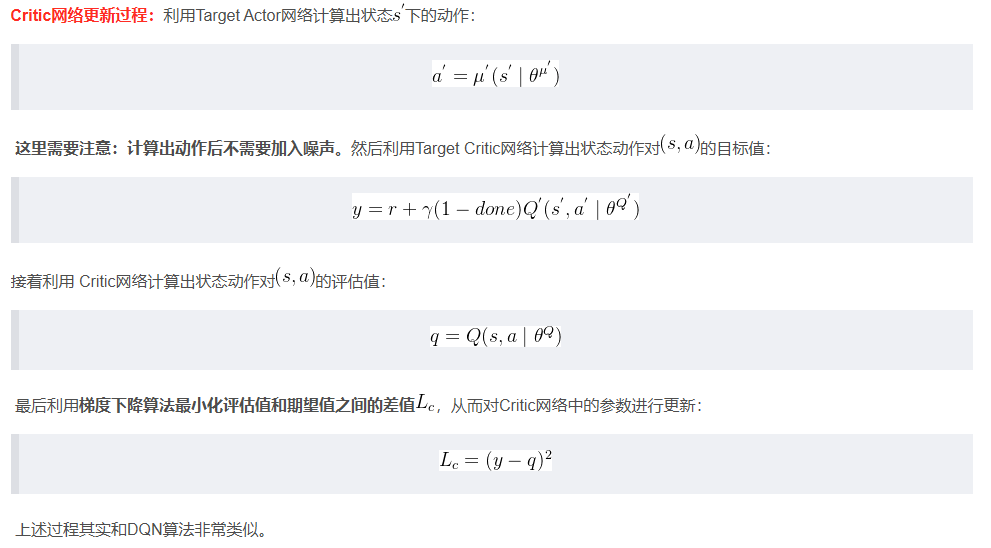

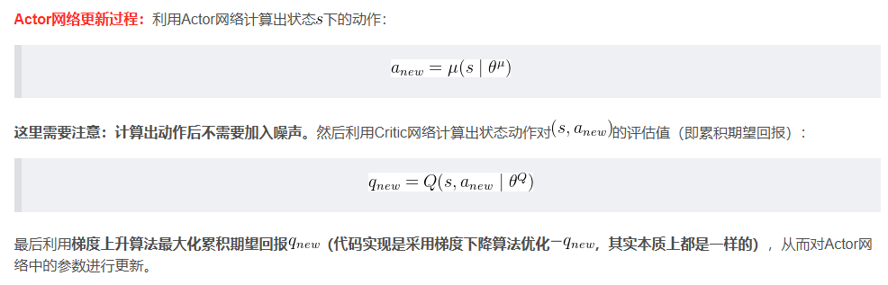

对于目标网络的更新，主要采取的是软更新的方式，也称为指数平均移动EMA。即引入一个学习率Γ，将旧网络的目标网络参数和新的对应网络参数做加权平均，然后赋值给目标网络

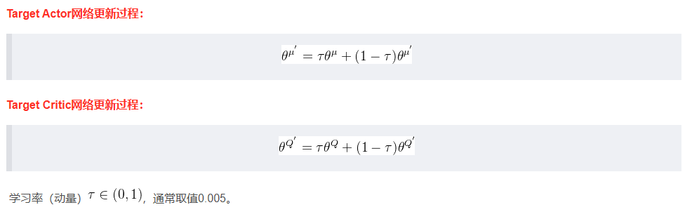

(3)噪声探索

探索对于智能体来说是至关重要的，而确定性策略“天生”就缺乏探索能力，因此需要人为给输出的动作上加入噪声，从而让智能体具备探索能力。DDPG算法中采用Ornstein Uhlenbeck过程作为动作噪声，而实际上OU噪声也可以使用服从正态分布的噪声替代（这就是TD3算法），实现起来更简单。

需要注意的是，噪声只会加在训练阶段Actor网络输出的动作上，推理阶段不要加上噪声，以及在更新网络参数时也不要加上噪声。总的来说就是，只需要在训练阶段让智能体具备探索能力，推理时是不需要的。

## 2.实验设计

与解决MountainCar的DQN算法的设计相同，使用DDPG算法解决MountainCarContinuous问题的具体步骤也分为：

1. 模型构建
2. 训练配置
3. 训练模型
4. 模型评估

### 2.1 模型构建

前面已经介绍过，DDPG算法主要包括三个关键技术：经验回放、目标网络和噪声探索，下面将分别实现。

#### 2.1.1 经验回放

从存储的角度来看，经验回放可以分为集中式回放和分布式回放；从采样的角度来看，经验回放可以分为均匀回放和优先回放。下面这段代码实现的是集中式均匀回放（实际上与DQN中实现的经验回放算法完全一致）

```py
class ReplayMemory: # 经验回放算法
    def __init__(self, capacity, transition):
        self.capacity = capacity # 经验池的容量
        self.memory = deque(maxlen=capacity) # 用deque实现经验池，deque是一个双向队列，可以从两端append和pop
        self.Transition = transition # 用于保存transition的数据结构

    def push(self, *args):
        self.memory.append(self.Transition(*args)) # 将transition存入经验池

    def sample(self, batch_size):
        return random.sample(self.memory, min(batch_size, len(self.memory))) # 从经验池中随机采样

    def __len__(self):
        return len(self.memory) # 返回经验池的长度
```

#### 2.1.2 噪声探索

在DDPG（Deep Deterministic Policy Gradient）算法中，噪声探索起着关键的作用。它的目的是在训练过程中引入一定程度的随机性，以便智能体能够探索环境并发现更优的策略。

DDPG算法是一种用于解决连续动作空间的强化学习算法。它结合了深度神经网络和确定性策略梯度（DPG）算法的思想。在DPG中，智能体学习一个确定性策略函数，直接输出动作值，而不是输出动作的概率分布。这使得DPG算法在处理连续动作空间时更有效。

然而，确定性策略在探索未知环境时可能会陷入局部最优解。为了解决这个问题，DDPG引入了一种噪声探索方法。噪声可以增加智能体的行动多样性，从而使其有更多机会探索环境中的不同策略，并找到更优的策略。

常用的噪声探索方法之一是OU（Ornstein-Uhlenbeck）噪声。OU噪声是一种具有回归特性的随机过程，它可以产生连续的随机值。在DDPG中，OU噪声被添加到智能体选择的动作上，以产生随机性。OU噪声具有以下特点：

1. OU噪声是一种高度相关的噪声，具有回归特性，它会将值推回到平均值附近。这使得智能体的行动不会变得过于剧烈或不稳定。
2. OU噪声具有可调节的方差和均值，可以通过调整参数来控制噪声的幅度。这使得智能体可以根据需要在探索和利用之间进行权衡。
3. OU噪声的自相关性可以帮助智能体在时间上保持一定的一致性。这对于连续动作空间中的探索非常有用，因为它可以使智能体在执行连续动作时保持平滑性。

下面这段代码实现了一个OU噪声类，用于生成具有回归性质的噪声

```py
class Noise: # Ornstein-Uhlenbeck噪声
    def __init__(self, mu, theta, sigma, action_dim):
        self.mu = mu # 均值
        self.theta = theta # 回归速度
        self.sigma = sigma # 标准差
        self.action_dim = action_dim # 动作维度
        self.state = np.full(action_dim, mu) # 初始化状态

    def reset(self):
        self.state = np.full(self.action_dim, self.mu) # 重置状态

    def make_noise(self):
        delta = self.theta * (self.mu - self.state) + self.sigma * np.random.randn(self.action_dim) # 计算噪声
        # self.state += delta
        self.state = np.clip(self.state + delta, 0, 1) # 将噪声限制在[0, 1]之间
        return self.state
```

在类的初始化方法中定义了OU噪声的参数，分别是均值、回归速度、标准差和动作维度，这些参数将用于后续计算噪声。另外一个属性是state，表示噪声状态，在初始化时该属性被设置为长度为action_dim且数组元素都是mu的数组，这表示初始状态下的噪声值都是均值。

类的reset方法用于重置噪声状态，执行该方法后噪声的状态将回到初始状态。

类的make_noise方法用于生成噪声，具体的执行步骤为：

1. 计算OU过程的变化量delta，该变化量主要分为噪声向均值回归的速度和随机扰动两部分。
2. 接着更新state为当前状态加上delta，使得噪声的值具有一定的回归性质。因为MountainCarContinuous环境的限制，因此需要将状态限制在[0,1]范围内。
3. 返回更新后的噪声作为生成的噪声。

#### 2.1.3 目标网络

下面是DDPG中的Actor网络和Critic网络关系

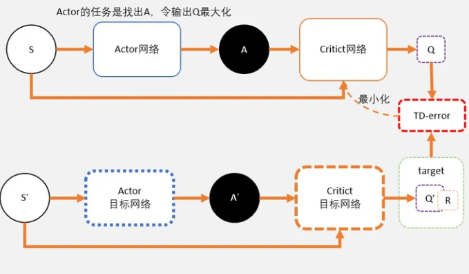

Actor网络

- 和AC不同，Actor输出的是一个动作；
- Actor的功能是，输出一个动作A，这个动作A输入到Crititc后，能够获得最大的Q值。
- 所以Actor的更新方式和AC不同，不是用带权重梯度更新，而是用梯度上升。

Critic网络

- Critic网络的作用是预估Q，虽然它还叫Critic，但和AC中的Critic不一样，这里预估的是Q不是V；
- 注意Critic的输入有两个：动作和状态，需要一起输入到Critic中；
- Critic网络的loss其还是和AC一样，用的是TD-error。这里就不详细说明了，我详细大家学习了那么久，也知道为什么了。

在DDPG算法中，值网络（Critic网络）用于评估给定状态和动作的值函数（Q函数）的估计值，即根据当前策略评估动作的好坏。策略网络（Actor网络）则用于生成确定性的动作值，即根据给定状态选择最优的动作。这两个网络通过交互和优化的方式相互影响和更新，从而达到同时学习值函数和策略函数的目的，以优化智能体的决策和行为策略。

在我们构建的Critic网络中，包含三个线性层的神经网络，输入层的维度为状态的维度，输出层的维度为1，中间隐藏层的维度通过参数指定。Critic网络的的前向传播算法根据输入的状态和动作经过一系列的线性层和激活函数（如ReLU）处理，最终输出值函数的估计值。

```py
class ValueNetwork(nn.Module): # 值网络，即Critic网络
    def __init__(self, hidden_size_1, hidden_size_2, input_size, action_size):
        super(ValueNetwork, self).__init__()

        self.linear1 = nn.Linear(input_size, hidden_size_1) # 输入层，输入维度为state的维度，输出维度为hidden_size_1
        self.linear2 = nn.Linear(hidden_size_1 + action_size, hidden_size_2) # 隐藏层，输入维度为hidden_size_1 + action_size，输出维度为hidden_size_2
        self.linear3 = nn.Linear(hidden_size_2, 1) # 输出层，输出维度为1

    def forward(self, state, action): # 前向传播算法
        x = F.relu(self.linear1(state))
        x = torch.cat((x, action), dim=1) # 将state和action拼接在一起
        x = F.relu(self.linear2(x))
        x = self.linear3(x)
        return x
```

Actor网络用于近似策略函数，包含三个线性层的神经网络，输入层的维度为状态的维度，输出层的维度为动作的维度，中间隐藏层的维度通过参数指定。Actor网络的前向传播输入状态，经过一系列的线性层和激活函数（如ReLU）处理，最终输出一个确定性的动作值。

```py
class PolicyNetwork(nn.Module): # 策略网络，即Actor网络
    def __init__(self, hidden_size_1, hidden_size_2, input_size, action_size):
        super(PolicyNetwork, self).__init__()

        self.linear1 = nn.Linear(input_size, hidden_size_1) # 输入层，输入维度为state的维度，输出维度为hidden_size_1
        self.linear2 = nn.Linear(hidden_size_1, hidden_size_2) # 隐藏层，输入维度为hidden_size_1，输出维度为hidden_size_2
        self.linear3 = nn.Linear(hidden_size_2, action_size) # 输出层，输出维度为action的维度

    def forward(self, state):
        x = F.relu(self.linear1(state))
        x = F.relu(self.linear2(x))
        x = torch.tanh(self.linear3(x))
        return x
```

#### 2.1.4 DDPG模型

我们已经知道DDPG算法的伪代码

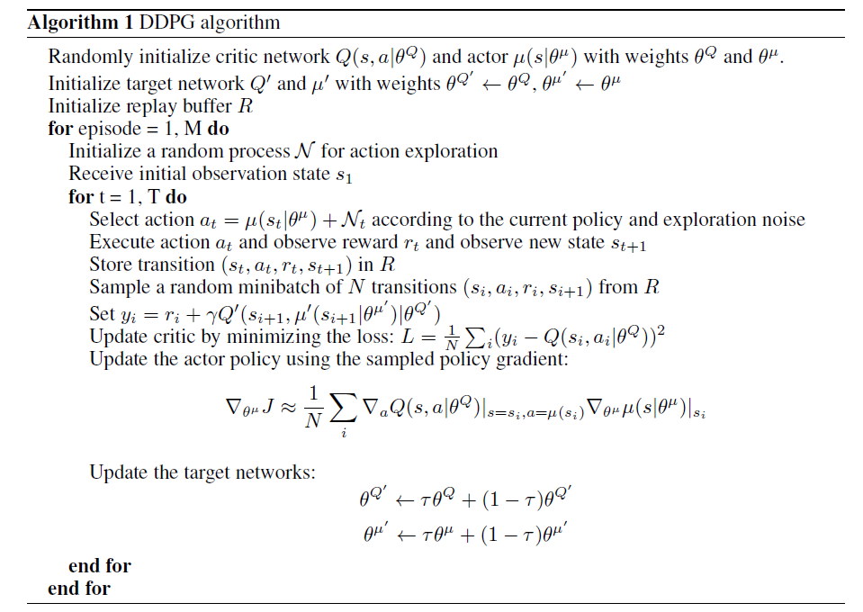

DDPG算法的核心逻辑是通过交替进行Critic网络参数更新和Actor网络参数更新，并使用软更新策略来更新目标网络的参数。通过这样的方式逐步优化智能体的策略和值函数的估计，实现在连续动作空间下的强化学习。实现DDPG算法的核心逻辑主要分为如下几个步骤：

1. 初始化：
   - 定义算法的参数，如网络结构、学习率、优化器等。
   - 创建值网络（Critic网络）的估计网络和目标网络，以及策略网络（Actor网络）的估计网络和目标网络。
   - 将估计网络的参数复制给目标网络。
2. 定义Q函数（值函数）的估计和目标：
   - 提供一个状态和动作作为输入，分别通过值网络的估计网络和目标网络计算对应的Q值。
3. 定义策略的估计和目标：
   - 提供一个状态作为输入，通过策略网络的估计网络和目标网络计算对应的策略动作。
4. Critic网络参数更新：
   - 根据估计值和目标值计算Critic网络的损失。
   - 使用Critic网络的优化器对损失进行反向传播和参数更新。
   - 对梯度进行裁剪，防止梯度爆炸。
   - 更新Critic网络的参数。
5. Actor网络参数更新：
   - 根据状态计算Actor网络的损失。
   - 使用Actor网络的优化器对损失进行反向传播和参数更新。
   - 对梯度进行裁剪，防止梯度爆炸。
   - 更新Actor网络的参数。
6. 目标网络软更新：
   - 通过软更新策略，将估计网络的参数以一定的权重加到目标网络的参数上，实现目标网络的平滑更新。

DDPG类的初始化方法定义了各项参数以及网络结构

```py
def __init__(self, layers_sizes, polyak=0.9999,
                 critic_lr=0.0001, critic_optim_method=optim.Adam, critic_loss=F.mse_loss,
                 actor_lr=0.0001, actor_optim_method=optim.Adam):
        self.polyak = polyak # 软更新的系数

        self.CriticEstimate = ValueNetwork(*layers_sizes) # 创建Critic的估计网络
        self.CriticTarget = ValueNetwork(*layers_sizes)  # 创建Critic的目标网络
        self.CriticTarget.load_state_dict(self.CriticEstimate.state_dict()) # 将估计网络的参数复制给目标网络
        self.critic_loss = critic_loss # Critic网络的损失函数
        self.critic_optimizer = critic_optim_method(self.CriticEstimate.parameters(), lr=critic_lr) # Critic网络的优化器

        self.ActorEstimate = PolicyNetwork(*layers_sizes) # 创建Actor的估计网络
        self.ActorTarget = PolicyNetwork(*layers_sizes) # 创建Actor的目标网络
        self.ActorTarget.load_state_dict(self.ActorEstimate.state_dict()) # 将估计网络的参数复制给目标网络
        self.actor_optimizer = actor_optim_method(self.ActorEstimate.parameters(), lr=actor_lr) # Actor网络的优化器
```

接着定义了几个函数用于获取网络输出

- Q_estimate函数返回Critic网络估计值。
- Q_target函数返回Critic网络目标值。
- action_estimate函数返回Actor网络估计值。
- action_target函数返回Actor网络目标值。

DDPG类的update_critic_params函数和update_critic_params函数用于更新网络参数：

```py
def update_critic_params(self, estimates, targets): # 更新Critic网络的参数
        loss = self.critic_loss(estimates, targets) # 计算损失
        self.critic_optimizer.zero_grad() # 梯度清零
        loss.backward() # 反向传播
        torch.nn.utils.clip_grad_norm_(self.CriticEstimate.parameters(), 1) # 梯度裁剪
        self.critic_optimizer.step() # 更新参数

def update_actor_params(self, states):
        loss = self.actor_loss(states)
        self.actor_optimizer.zero_grad()
        loss.backward()
        torch.nn.utils.clip_grad_norm_(self.ActorEstimate.parameters(), 1)
        self.actor_optimizer.step()
```


- update_critic_params函数用于更新Critic网络的参数。
  - 根据输入的估计值和目标值计算损失。
  - 通过优化器将损失进行反向传播和参数更新，同时进行梯度裁剪。
- update_actor_params函数用于更新Actor网络的参数。
  - 根据输入的状态计算Actor网络的损失。
  - 通过优化器将损失进行反向传播和参数更新，同时进行梯度裁剪。

额外的，actor_loss函数实现计算Actor网络的损失函数。通过调用action_estimate获取Actor网络的估计值，接着返回负的Critic网络估计值的平均值，即最大化Critic网络的Q值。

```py
def actor_loss(self, states): # Actor网络的损失函数
        actions = self.action_estimate(states) # 估计值
        return -self.Q_estimate(states, actions).mean() # 最大化Q值
```

soft_update函数通过迭代估计模型和目标模型的参数，并将目标模型参数进行软更新。

```py
def soft_update(self, estimate_model, target_model): # 软更新
        for estimate_param, target_param in zip(estimate_model.parameters(), target_model.parameters()): # 更新每一个参数
            target_param.data.copy_(target_param.data * self.polyak + estimate_param.data * (1 - self.polyak))
```

#### 2.1.5 Agent类

DDPG算法的Agent类的实现基本与DQN中的Agent实现类似，同样包含初始化方法、act方法以及optimize方法。类的初始化方法主要用于接收并初始化一系列参数，代码中都有注释因此这里不再过多解释。

Agent的act方法用于选择动作，其选择动作的步骤主要如下

1. 接收当前状态和一个epsilon值，用于epsilon-greedy策略。
2. 使用模型的估计网络基于当前状态选择动作。
3. 通过噪声对象生成噪声，并与动作相加。
4. 限制动作范围在环境的动作空间内，通过clamp_方法实现。

```py
def act(self, state, eps): # 选择动作
        with torch.no_grad(): # 关闭梯度
            action = self.Model.action_estimate(state) # 基于当前状态选择动作
            noise = torch.tensor(eps * self.noise.make_noise()).unsqueeze(0) # 增加噪声
            action += noise # 在动作上增加噪声
        return action.clamp_(self.env.action_space.low[0], self.env.action_space.high[0]) # 限制动作范围在环境的动作空间内
```

Agent的optimize方法实现了对网络优化，通过更新Critic网络参数和Actor网络参数，以逐步提升智能体的策略和值函数的估计。

```py
def optimize(self): # 优化器
        if len(self.memory) < self.batch_size: # 经验池中的样本数量小于batch_size，不需要进行优化
            return

        transitions = self.memory.sample(self.batch_size) # 从经验池中采样
        batch = self.Transition(*zip(*transitions)) # 将样本转换为batch

        next_state_batch = torch.cat(batch.next_state)
        state_batch = torch.cat(batch.state)
        action_batch = torch.cat(batch.action)
        reward_batch = torch.cat(batch.reward)
        done_batch = torch.cat(batch.done)

        estimates = self.Model.Q_estimate(state_batch, action_batch) # 网络的估计值
        Q_next = torch.zeros(self.batch_size, device=self.device).unsqueeze(1) # 下一个状态的Q值
        with torch.no_grad():
            next_actions = self.Model.action_target(next_state_batch) # 下一个状态的动作
            Q_next[~done_batch] = self.Model.Q_target(next_state_batch, next_actions)[~done_batch] # 下一个状态的Q值
        targets = reward_batch.unsqueeze(1) + self.gamma * Q_next # 目标值
        self.Model.update_critic_params(estimates, targets) # 更新Critic网络参数
        self.Model.update_actor_params(state_batch) # 更新Actor网络参数
```

当执行optimize方法时，它会按照以下方法进行优化：

1. 检查经验池中的样本数量是否大于批大小。如果小于批大小，方法将直接返回，不进行优化。
2. 从经验池中随机采样一批数据。
3. 将采样得到的数据分别提取为状态、动作、奖励、下一个状态和完成标志的张量。
4. 使用值网络（Critic网络）的估计网络计算当前状态和动作的值估计。
5. 创建一个全零张量作为下一个状态的Q值。
6. 对于未完成的样本，使用目标网络计算下一个状态的动作值，并将其赋值给下一个状态的Q值。
7. 计算目标值作为当前奖励加上折扣因子乘以下一个状态的Q值。
8. 调用模型的方法，更新Critic网络参数和Actor网络参数。

### 2.2 训练配置

此处的配置过程与DQN算法中的配置过程相同，首先通过gym创建MountainCarContinuous训练环境并设置全局变量

```py
device = torch.device("cuda" if torch.cuda.is_available() else "cpu")
env = gym.make('MountainCarContinuous-v0')
n_actions = env.action_space.shape[0]  # 动作空间的维度，1
n_states = env.observation_space.shape[0]  # 状态空间的维度，2
Transition = namedtuple('Transition', ('state', 'action', 'next_state', 'reward', 'done'))  # 定义Transition元组
noise = Noise(0, 0.15, 0.2, n_actions)  # 定义噪声
```

然后通过自定义的layers传入DDPG类实例化模型

```py
layers = (256, 256, n_states, n_actions)  # 定义神经网络的结构

Model = DDPG(layers, polyak=0.999, \
                 critic_lr=0.005, critic_optim_method=optim.Adam, critic_loss=F.mse_loss, \
                 actor_lr=0.0005, actor_optim_method=optim.Adam)  # 定义DDPG模型
```

最后对智能体进行实例化

```py
MountainCarAgent = Agent(device, Transition, env, Model, noise, goal=91, min_score=-100, \
                             gamma=0.9, batch_size=128, memory_size=20000, max_episode=100, upd_rate=1,
                             exploration_episodes=10)  # 定义agent
```

### 2.3 训练模型

基于DDPG算法，在MountainCarContinuous环境下训练一个Agent，其核心在于在主循环中对每个episode进行训练。因为此处的代码大部分和DQN中的训练模型模块重复，因此这里仅介绍不同的地方。

```py
if ep > agent.exploration_episodes: # 前几个episode使用epsilon-greedy策略
	action = agent.act(state, eps) # 选择动作
else: # 后面的episode使用随机策略
	action = torch.tensor([np.random.uniform(agent.env.action_space.low[0], agent.env.action_space.high[0])]) # 随机选择动作
	action = action.unsqueeze(0) # 将动作转换为tensor
```

在初始阶段，Agent对环境了解有限，还没有收集到足够的经验。如果直接使用当前的策略网络来选择动作，可能会导致Agent陷入局部最优解，无法发现更好的策略。通过引入epsilon-greedy策略，可以以一定的概率选择随机动作，探索环境中不同的动作选择，从而更全面地探索环境，收集更多的经验。

而随着训练的进行，Agent逐渐积累了更多的经验，对环境的了解也逐渐增加。因此，在后面的episode中，可以逐渐减小epsilon的值，让Agent更加倾向于选择当前估计最优的动作，以加快收敛到最优策略的速度。

因为DDPG算法的收敛速度比较快，所以判断成功的标准与DQN不同

```py
if np.mean(all_scores[:-10:-1]) >= agent.goal: # 如果连续10个episode的平均reward大于goal，就保存模型
	successful_sequences += 1
	if successful_sequences == 5:
		print('success at episode', ep)
		return all_scores
else:
	successful_sequences = 0 # 如果连续10个episode的平均reward小于goal，就重置successful_sequences
```

### 2.4 模型评估

test函数用于测试训练好的Agent在MountainCarContinuous环境下的表现，其代码如下

```py
def test(agent,episodes = 50,render = False):
    print('----------Start testing----------')
    scores = []
    for _ in range(episodes): # 测试50个episode
        state = agent.env.reset() # 初始化环境
        state = torch.tensor(state).to(agent.device).float().unsqueeze(0) # 将state转换为tensor
        episode_reward = 0 # 记录每个episode的reward
        done = False # 记录训练是否结束

        while not done:
            if render: # 如果render为True，则渲染环境
                agent.env.render()
            action = agent.act(state, 0) # 选择动作，epsilon为0，即完全按照actor网络选择动作
            state, reward, done, _ = agent.env.step(action) # 执行动作，返回下一个状态、reward、是否结束、以及info
            state = torch.tensor(state).to(agent.device).float().unsqueeze(0)
            episode_reward += reward

        scores.append(episode_reward)

    print('average score:', sum(scores) / len(scores))
    print('max reward:', max(scores))
    print('min reward:', min(scores))
```

核心在于测试阶段不需要探索，因此选择动作的时候的epsilon被设为0。通过执行选择的动作获取需要的信息，将下一个状态转换为tensor，并累加奖励到当前episode的reward。

每个eposide都将reward保存到scores列表中，最后输出测试结果。

## 3.实验结果分析

MountainCar以及MountainCarCountinuous环境本身就是一个具有挑战性的问题，需要更多的探索和学习过程才能找到有效的策略。DQN算法与DDPG算法相比，可能需要更多的训练和调优才能达到较好的性能。这并不意味着DQN算法劣于DDPG算法，在处理离散动作空间的问题上，DQN算法表现出色；而在处理连续动作空间的问题上，DDPG算法更为适用。使用哪种算法取决于具体问题的性质和要求。

以下是DDPG算法在训练过程中的表现

```
----------Start training----------
-32.57999070546883 at episode 1
-33.51094860898655 at episode 2
-34.582150023628 at episode 3
-35.57697056390748 at episode 4
-32.52166978406886 at episode 5
episode 5 : -33.75434593721195 average score
-33.40841506922292 at episode 6
-33.32177132678317 at episode 7
-31.567093970977933 at episode 8
-33.1938497927424 at episode 9
-35.80485747012956 at episode 10
episode 10 : -33.720858512271874 average score
95.04311467530225 at episode 11
95.04600922740354 at episode 12
95.75226781157222 at episode 13
94.6952507746258 at episode 14
95.32320696155898 at episode 15
episode 15 : 37.99691965442552 average score
96.20291414661227 at episode 16
94.62420640626543 at episode 17
96.39043425577762 at episode 18
95.93245207258869 at episode 19
97.02252299241141 at episode 20
episode 20 : 95.66547384986845 average score
95.52305832954589 at episode 21
96.06678708626804 at episode 22
94.3707215235742 at episode 23
success at episode 23
```

对应的训练性能曲线如下

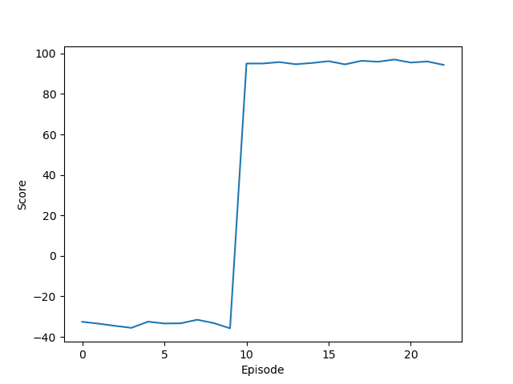

训练好的模型在测试环境下得到的分数如下

```
----------Start testing----------
average score: 96.69259337679256
max reward: 97.50456212093064
min reward: 95.32685001504397
```

通过以上结果可以看出，DDPG算法在解决MountainCarContinuous上非常的适用。不仅在训练时可以很快的收敛，同时在测试阶段的得分和表现也非常的优秀。


# 三、讨论与思考

本次实验分别尝试使用了DQN算法解决gym中的MountainCar问题以及使用DDPG算法解决MountainCarContinuous问题。这两种算法在解决相应问题上的效果客观上来说是不错的，而DDPG算法在收敛速度以及得分方面比DQN更优秀一些，推测原因可能是结合使用了DQN算法以及噪声探索、目标网络。

在设计DQN算法以及DDPG算法时，难点主要在于如何设计算法的核心要素如网络结构设计、经验回放等。尽管DQN模型已经可以解决MountainCar问题，还可以尝试使用DQN算法的变体（如Double DQN、Dueling DQN、Rainbow等）以探索是否可以进一步提升性能，甚至可以尝试其他强化学习算法来解决这些问题，MountainCarContinuous同理。

总而言之，通过手动实现深度强化学习算法，巩固了我对于强化学习算法的理解，同时对这个领域的相关知识点产生浓厚的兴趣，希望未来能有进一步的研究。


